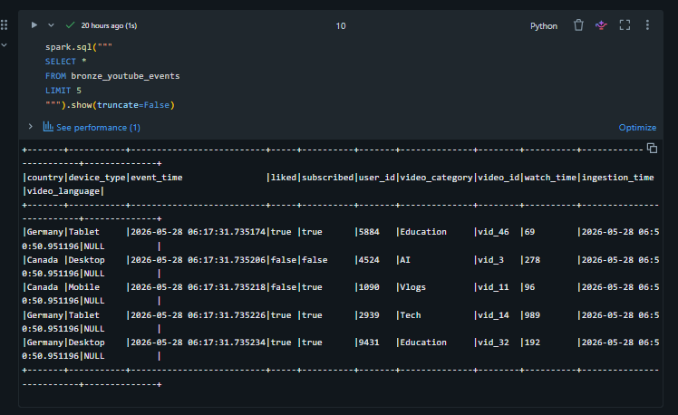
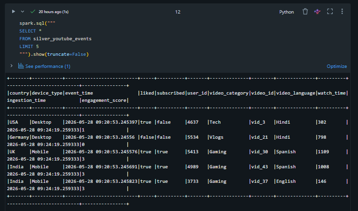
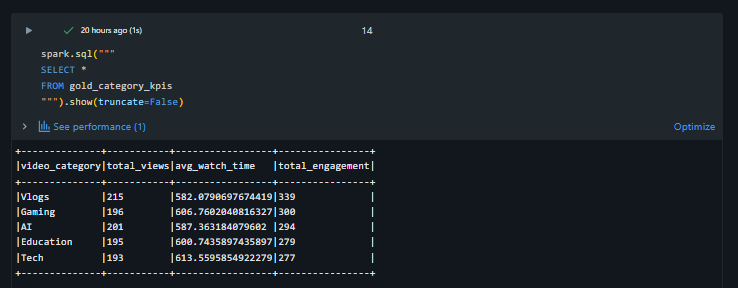
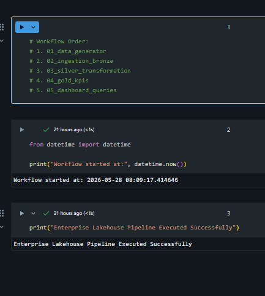

# Enterprise Lakehouse Analytics Platform using Databricks, Delta Lake & AWS

## Overview

This project demonstrates the design and implementation of a cloud-native lakehouse analytics platform using AWS S3, Databricks, PySpark, and Delta Lake. The platform processes semi-structured YouTube engagement events through a Medallion Architecture consisting of Bronze, Silver, and Gold layers.

The solution implements incremental ETL pipelines, schema evolution, workflow orchestration, Delta Lake optimizations, partitioned tables, and business-ready KPI analytics workloads.

## Architecture


## Technology Stack

* AWS S3
* Databricks
* PySpark
* Delta Lake
* Python
* Spark SQL
* Databricks Workflows

## Medallion Architecture

### Bronze Layer

* Raw data ingestion from AWS S3
* Schema evolution support
* Ingestion metadata tracking
* Delta Lake storage

### Silver Layer

* Data validation and cleansing
* Deduplication
* Business transformations
* Analytics-ready datasets

### Gold Layer

* KPI aggregations
* Category analytics
* Country analytics
* Device analytics
* Reporting workloads

## Key Features

* Incremental ETL pipelines
* Schema evolution handling
* Delta Lake optimization
* Workflow orchestration
* Distributed Spark transformations
* Partitioned Delta tables
* Cloud-native storage architecture

## Project Structure

```text
enterprise-lakehouse-analytics-platform/
├── notebooks/
├── screenshots/
├── architecture/
├── sample_data/
└── README.md
```

## Sample Outputs

### Bronze Layer



### Silver Layer



### Gold KPIs



### Workflow Pipeline



## Future Enhancements

* Databricks Dashboard Integration
* Real-Time Streaming Pipelines
* Kafka-Based Event Processing
* Data Quality Monitoring
* CI/CD Automation

## Author

Pratham Taak
